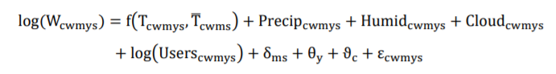

# 1-27 #
## Rapidly declining remarkability of temperature ##

###key point : 长期（反复）的经历异常天气会让人对于气温异常的感知力下降。

研究作用： 揭露人们对异常天气感知的模糊，利于环境政策的实施

数据来源：
----------
- twitter数据 2014-2016
- 气温数据   1981-2016 **PRISM data set**
- 湿度数据 NCEP Reanalysis II

研究方法：
----------
Data Processing ：

- 推文主题分析：bag-of-words
- 人工确认

情感分析：

1. VADER
2. LIWC
 
Sentiment analysis is performed at the core-based statistical area (**CBSA**) level, rather than the county level

回归分析：

**因变量**是天气推特数的log，按照周，月，年，县，州划分。

**自变量**是函数 f（近期气温，参考气温），此外还有包括控制变量：
1. 降水，适度，云层，Twitter用户数量等）以及他们的高次项和乘积（异方差？）
2. 时不变差异：County指示系数 
3. 季节性地区差异 month&state
4. 一般时间趋势年固定影响控制 year      （2，3，4 -虚拟变量？）
5. 对残差聚类研究 州内（state）的时空自相关效应

学习模型：
学习时期（文中使用2-8年前）异常天气影响的加权和
权重为滞后系数的占比

研究逻辑
----------
1. 按照week-county的方式合并数据得到panel data
2. 用1981-1990 年的 数据 作为 参考 【基线期】
3. 用温度变化的空间和季节性不同（和参考时期的温度均值的差）来**确定**温度异常的感知的逐渐变化的效果
4. 对log（天气微博数）【相关微博数反应变化的百分比对天气异常的认知情况】做实证分析（同期回归），进一步做有限分布滞后回归，**发现滞后效果是与同期效果相反的**
5. 原因：1、适应性 2、 调整的期望（而非适应）
6. 再进行情感分析，气温异常越显著，负面情感越大，用综合情感得分 同样进行回归，得到差不多的结论，不同的是，负面情感不随着长期接触异常天气而消失。从而证明了上述结论的原因是期望的调整，和极少的适应性。
7. 使用学习模型，来学习 **期望的基准线**的变化（实际上是上升）

参考文献
----------
previous work on the relationship between temperature and sentiment (8)

